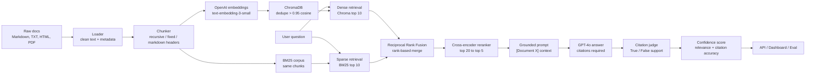

# RAG Hybrid Search

A production-style Retrieval-Augmented Generation system for internal documents. It ingests company docs, chunks them, indexes them with dense embeddings, retrieves with hybrid dense plus sparse search, reranks the best evidence, generates grounded answers, verifies citations, and exposes everything through an API and Streamlit dashboard.

## Why This Project Exists

Most RAG demos stop at "upload one PDF and ask questions." This project is built closer to real AI engineering work: multiple document formats, chunking choices, ChromaDB persistence, duplicate prevention, hybrid retrieval, rank fusion, reranking, grounded generation, citation verification, confidence scoring, evaluation, API shipping, and a live dashboard.

## What It Does

- Loads Markdown, text, HTML, and PDF files from `data/docs/`.
- Cleans documents and stores normalized records.
- Splits content with recursive, fixed, or Markdown-header-aware chunking.
- Embeds chunks with `text-embedding-3-small`.
- Stores vectors in local ChromaDB.
- Skips near-duplicate chunks when cosine similarity is greater than `0.95`.
- Retrieves with both dense vector search and BM25 keyword search.
- Merges dense and sparse results with Reciprocal Rank Fusion.
- Reranks the top fused candidates with a cross-encoder.
- Generates GPT-4o answers using only retrieved context.
- Requires inline citations like `[Document 1]`.
- Verifies citations with a secondary judge model.
- Returns confidence scores and safe fallback responses.
- Provides FastAPI endpoints, a Streamlit dashboard, Docker Compose, and evaluation scripts.

## Workflow



## Tech Stack

| Layer | Tools |
| --- | --- |
| Language | Python 3.11+ |
| Loading | BeautifulSoup, pdfplumber, PyPDF2 |
| Chunking | LangChain text splitters |
| Embeddings | OpenAI `text-embedding-3-small` |
| Vector store | ChromaDB |
| Sparse retrieval | rank-bm25 |
| Fusion | Reciprocal Rank Fusion |
| Reranking | sentence-transformers cross-encoder |
| Generation | GPT-4o |
| Citation judging | GPT-4o mini |
| API | FastAPI, Uvicorn |
| Dashboard | Streamlit |
| Evaluation | Python JSON reports |
| Shipping | Docker, Docker Compose |

## Project Structure

```text
rag-hybrid-search/
|-- data/
|   |-- docs/
|   |-- processed/
|   `-- chroma/
|-- docs/
|   `-- demo_walkthrough.md
|-- eval/
|   |-- golden_dataset.json
|   `-- run_eval.py
|-- frontend/
|   `-- app.py
|-- scripts/
|   `-- phase1_ingest.py
|-- src/
|   |-- api/
|   |   |-- main.py
|   |   `-- schemas.py
|   |-- data/
|   |   |-- loader.py
|   |   `-- chunker.py
|   |-- generation/
|   |   |-- prompts.py
|   |   |-- llm.py
|   |   `-- citation_judge.py
|   |-- indexing/
|   |   |-- embedder.py
|   |   `-- vector_store.py
|   `-- retrieval/
|       |-- dense.py
|       |-- sparse.py
|       |-- fusion.py
|       |-- reranker.py
|       |-- hybrid.py
|       `-- types.py
|-- tests/
|-- Dockerfile
|-- docker-compose.yml
|-- requirements.txt
`-- README.md
```

## Quickstart

Clone the repo:

```bash
git clone https://github.com/omjoshi17/rag-hybrid-search.git
cd rag-hybrid-search
```

Create and activate a virtual environment:

```bash
python -m venv .venv
.venv\Scripts\activate
```

Install dependencies:

```bash
pip install -r requirements.txt
```

Create your environment file:

```bash
copy .env.example .env
```

Set your OpenAI key in `.env`:

```text
OPENAI_API_KEY=your_openai_api_key_here
```

## Index Documents

Place files in `data/docs/`, then run:

```bash
python scripts/phase1_ingest.py --strategy recursive --reset
```

Useful alternatives:

```bash
python scripts/phase1_ingest.py --strategy semantic_markdown --reset
python scripts/phase1_ingest.py --strategy fixed --chunk-size 900 --chunk-overlap 150 --reset
```

## Ask From The CLI

Run hybrid retrieval only:

```bash
python -m src.retrieval.hybrid "When should critical incidents be escalated?"
```

Run grounded generation with citations:

```bash
python -m src.generation.llm "When should critical incidents be escalated?"
```

## Run The API

Start FastAPI:

```bash
uvicorn src.api.main:app --reload
```

Open:

- API health: `http://localhost:8000/health`
- OpenAPI docs: `http://localhost:8000/docs`

Useful endpoints:

| Method | Endpoint | Purpose |
| --- | --- | --- |
| `POST` | `/v1/ask` | Ask a grounded RAG question. |
| `POST` | `/v1/ingest` | Upload and index documents. |
| `GET` | `/v1/documents` | List indexed source documents. |
| `GET` | `/health` | Health check. |

Example request:

```bash
curl -X POST http://localhost:8000/v1/ask ^
  -H "Content-Type: application/json" ^
  -d "{\"question\":\"When should critical incidents be escalated?\"}"
```

## Run The Dashboard

In a second terminal:

```bash
streamlit run frontend/app.py
```

Open `http://localhost:8501`.

The dashboard lets you:

- Ask questions.
- Tune dense and sparse retrieval weights.
- Toggle cross-encoder reranking.
- Upload documents for ingestion.
- Inspect confidence scores, citation checks, and retrieved chunks.

## Run With Docker

Create `.env` first, then run:

```bash
docker compose up --build
```

Open:

- API: `http://localhost:8000`
- Dashboard: `http://localhost:8501`

The compose setup mounts `./data` into the containers so Chroma data and uploaded docs persist locally.

## Run Evaluation

Run a small smoke eval:

```bash
python eval/run_eval.py --limit 5
```

Run the full golden dataset:

```bash
python eval/run_eval.py --output eval/results.json
```

The report includes:

- Total cases
- Required-document retrieval hit rate
- Average citation accuracy
- Fallback rate
- Per-question results

## Verification

Run local checks:

```bash
python -m compileall src tests eval scripts frontend
python -m unittest discover -s tests
python -c "import json; print(len(json.load(open('eval/golden_dataset.json', encoding='utf-8'))))"
```

The last command should print `50`.

## Demo

See [docs/demo_walkthrough.md](docs/demo_walkthrough.md) for a short portfolio demo script.

## Notes

- Full indexing and answering require `OPENAI_API_KEY`.
- The first reranker run may download `cross-encoder/ms-marco-MiniLM-L-6-v2`.
- Chroma data is local and ignored by git.
- Generated eval reports are ignored by Docker builds.
